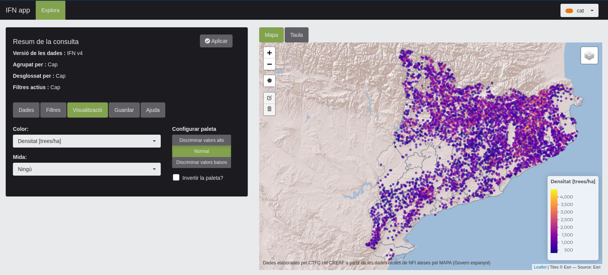
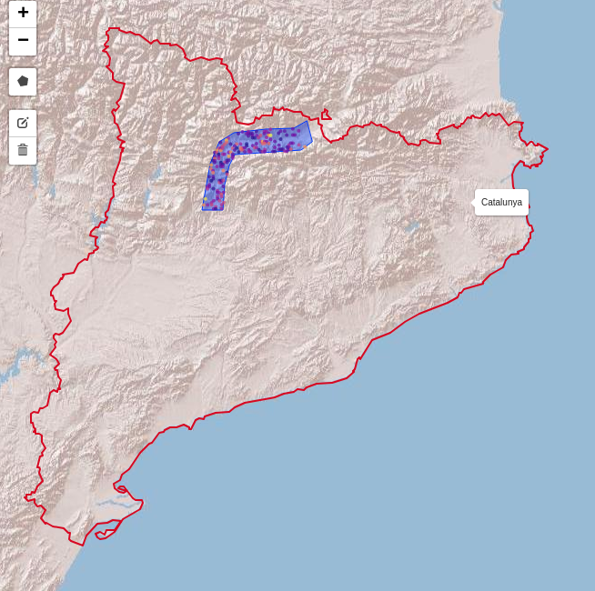
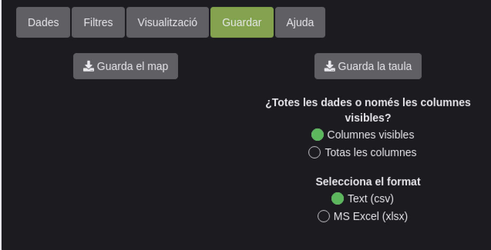
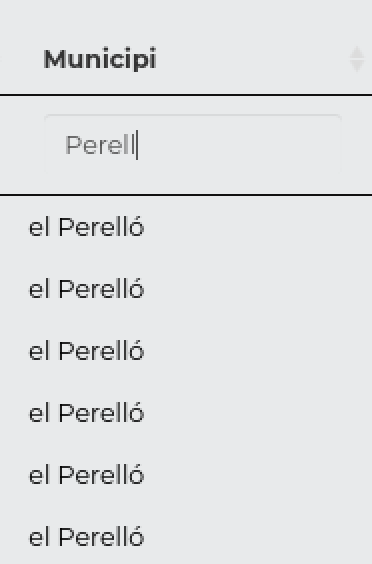

class: title-slide

# Laboratori Forestal Català

## Consulta de bases de datos forestales generadas por el CREAF y el CTFC

.pull-right[.font80[2021-03-01]]


```{r setup, include=FALSE}
options(htmltools.dir.version = FALSE)
suppressPackageStartupMessages(library(tidyverse))
library(lfcdata)
library(gt)

nfi_db <- nfi()
allometr_db <- allometries()
lidar_db <- lidar()
```

---
layout: false
class: inverse
background-image: url("img/lfc_logo.svg")

.font200[Laboratori Forestal Català]

El LFC es una iniciativa destinada a poner a disposición del público, experto o curioso, la información y los
datos relacionados con los bosques generados en los proyectos de investigación del CREAF y del CTFC.


---
layout: false
class: inverse
background-image: url("img/nfi_app_logo.png")

.font180[NFI app]

Acceder, visualizar y descargar los datos del Inventario Forestal Nacional en Cataluña

---
layout: false
class: inverse
background-image: url("img/allometries_app_logo.png")

.font180[Allometr app]

Base de datos de relaciones alómetricas y cubicaciones basadas en los datos del IFN, del Mapa de Coberturas de
Cataluña y del Instituto Nacional de Investigaciones Agrarias.

---
layout: false
class: inverse
background-image: url("img/lidar_app_logo.png")

.font180[LiDAR app]

Acceder y visualizar variables forestales calculadas a partir de vuelos LiDAR.

---
layout: false
class: inverse
background-image: url("img/fes_app_logo.png")

.font180[FES app]

Información de los servicios ecosistémicos de los bosques de Cataluña.

---
layout: false
class: inverse
background-image: url("img/meteoland_app_logo.png")

.font180[Meteoland app]

Base de datos de estimaciones diarías de datos climatológicos para toda Cataluña.

---
layout: false
class: inverse
background-image: url("img/catdrought_app_logo.png")

.font180[Catdrought app]

Estimaciones diarias del balance hídrico, la humedad del suelo y el estrés hídrico de los bosques de Cataluña.

---

layout: true

<div class="tweaked-header" style="background-image: url(img/logos.svg)"></div>

<div class="my-footer"><span>Laboratori Forestal Catalá</span></div>

---
layout: false
class: inverse
background-image: url("img/nfi_app_logo.png")

.font120[Inventario Forestal Nacional:] .font200[NFI App]

---

layout: true

<div class="tweaked-header" style="background-image: url(img/logos.svg)"></div>

<div class="my-footer"><span>Laboratori Forestal Catalá</span></div>

---

# Actualización de los Inventarios Forestales

  - Segundo Inventario Forestal Nacional (IFN2,
    `r nfi_db$get_data('plot_nfi_2_results') %>% nrow()` parcelas, realizado en 1990)  
  - Tercer Inventario Forestal Nacional (IFN3,
    `r nfi_db$get_data('plot_nfi_3_results') %>% nrow()` parcelas, realizado en 2000)  
  - Cuarto Inventario Forestal Nacional (IFN4,
    `r nfi_db$get_data('plot_nfi_4_results') %>% nrow()` parcelas, realizado en 2015)  

Cada inventario se realiza cada 10-15 años sobre las mismas parcelas, si es posible. Hay
**`r nfi_db$get_data('plots') %>% filter(presence_NFI_2, presence_NFI_3, presence_NFI_4) %>% collect() %>% nrow()`**
parcelas en común entre los tres inventarios,
**`r nfi_db$get_data('plots') %>% filter(presence_NFI_2, presence_NFI_3) %>% collect() %>% nrow()`**
parcelas en común entre el IFN2 y el IFN3 y
**`r nfi_db$get_data('plots') %>% filter(presence_NFI_3, presence_NFI_4) %>% collect() %>% nrow()`**
parcelas en común entre el IFN3 y el IFN4.


La principal ventaja del remuestreo de las parcelas es que permite comparaciones pie a pie:

  - pies supervivientes -> tasas de **crecimiento**
  - pies incorporados -> tasas de **reclutamiento**
  - pies aprovechados (desaparecidos) -> tasas de **explotación**
  - pies muertos -> tasas de **mortalidad**

---
layout: false
class: inverse

.font200[Conceptos importantes]

.font170[Presencia]

---

layout: true

<div class="tweaked-header" style="background-image: url(img/logos.svg)"></div>

<div class="my-footer"><span>Laboratori Forestal Catalá</span></div>

---

# Presencia

## Variables de presencia

1. **Densidad**: número de pies por hectárea  
1. **Área basal**: m² por hectárea

## Criterio de presencia

1. **Porcentaje (de densidad o de área basal)**, presente a nivel de parcela o en parcelas
  desglosadas por grupo funcional
1. **Orden (en densidad o en área basal)**, presente únicamente en la información de
  parcelas desglosadas por grupo funcional
   
---

# Presencia

## Ejemplo parcela desglosada por especie

```{r ejemplo_presencia_desglosado_sp, echo=FALSE}
tibble(
  Especie = c('Quercus ilex', 'Pinus halepensis', 'Pinus nigra', 'Quercus humilis'),
  area_basal_orden = c(2, 4, 1, 3),
  densidad_orden = c(1, 2, 3, 4),
  area_basal_porcentaje = c(30, 10, 35, 25),
  densidad_porcentaje = c(60, 20, 15, 5),
  area_basal = c(6,2,7,5),
  densidad = c(600, 200, 150, 50)
) %>%
  gt() %>%
  tab_header(
    title = 'Criterios de presencia',
    subtitle = ''
  ) %>%
  tab_spanner('Orden', c('area_basal_orden', 'densidad_orden')) %>%
  tab_spanner('Porcentaje', c('area_basal_porcentaje', 'densidad_porcentaje')) %>%
  tab_spanner('Valor real', c('area_basal', 'densidad')) %>%
  cols_label(
    area_basal_orden = 'Área basal', densidad_orden = 'Densidad',
    area_basal_porcentaje = 'Área basal', densidad_porcentaje = 'Densidad',
    area_basal = 'Área basal', densidad = 'Densidad'
  ) %>%
  tab_style(
    style = cell_text(weight = 'normal', size = 'medium', font = 'Raleway'),
    locations = cells_column_labels(TRUE)
  ) %>%
  tab_style(
    style = cell_text(weight = 'bold', size = 'medium', font = 'Raleway'),
    locations = cells_column_spanners(c('Porcentaje', 'Orden', 'Valor real'))
  ) %>%
  tab_style(
    style = cell_text(
      weight = 'normal', size = 'medium', font = 'Raleway', align = 'center'
    ),
    locations = cells_body(TRUE)
  ) %>%
  tab_style(
    style = cell_text(weight = 'normal', font = 'Raleway'),
    locations = cells_title('title')
  )
```

---

# Presencia

## Ejemplo misma parcela desglosada por esclerófila, caducifolia y conífera

```{r ejemplo_presencia_desglosado_dec, echo=FALSE}
tibble(
  Especie = c('Esclerófila', 'Conífera', 'Caducifolia'),
  area_basal_orden = c(2, 1, 3),
  densidad_orden = c(1, 2, 3),
  area_basal_porcentaje = c(30, 45, 25),
  densidad_porcentaje = c(60, 35, 5),
  area_basal = c(6,9,5),
  densidad = c(600, 350, 50)
) %>%
  gt() %>%
  tab_header(
    title = 'Criterios de presencia',
    subtitle = ''
  ) %>%
  tab_spanner('Orden', c('area_basal_orden', 'densidad_orden')) %>%
  tab_spanner('Porcentaje', c('area_basal_porcentaje', 'densidad_porcentaje')) %>%
  tab_spanner('Valor real', c('area_basal', 'densidad')) %>%
  cols_label(
    area_basal_orden = 'Área basal', densidad_orden = 'Densidad',
    area_basal_porcentaje = 'Área basal', densidad_porcentaje = 'Densidad',
    area_basal = 'Área basal', densidad = 'Densidad'
  ) %>%
  tab_style(
    style = cell_text(weight = 'normal', size = 'medium', font = 'Raleway'),
    locations = cells_column_labels(TRUE)
  ) %>%
  tab_style(
    style = cell_text(weight = 'bold', size = 'medium', font = 'Raleway'),
    locations = cells_column_spanners(c('Porcentaje', 'Orden', 'Valor real'))
  ) %>%
  tab_style(
    style = cell_text(
      weight = 'normal', size = 'medium', font = 'Raleway', align = 'center'
    ),
    locations = cells_body(TRUE)
  ) %>%
  tab_style(
    style = cell_text(weight = 'normal', font = 'Raleway'),
    locations = cells_title('title')
  )
```

---

# Presencia

## Ejemplo información de parcela

En este caso la información se resume en un único registro por parcela que muestra
el porcentaje en base a cada tipo funcional dominante en ambas variables, área basal y
densidad. Pero, y esto es importante, el resto de información dasométrica es para **todos**
los pies mayores de la parcela.

```{r ejemplo_presencia_parcela, echo=FALSE}
tibble(
  Parcela = 'P_xxxxx',
  sp_dom_ab = 'Pinus nigra',
  sp_dom_d = 'Quercus ilex',
  sp_dom_ab_perc = 35,
  sp_dom_d_perc = 60,
  area_basal = 20,
  densidad = 1000
) %>%
  gt(rowname_col = 'Parcela') %>%
  tab_header(
    title = 'Criterios de presencia',
    subtitle = ''
  ) %>%
  tab_spanner('Especie dominante', c('sp_dom_ab', 'sp_dom_d')) %>%
  tab_spanner('Porcentaje especie dominante', c('sp_dom_ab_perc', 'sp_dom_d_perc')) %>%
  tab_spanner('Valor total parcela', c('area_basal', 'densidad')) %>%
  cols_label(
    sp_dom_ab = 'Área basal', sp_dom_d = 'Densidad',
    sp_dom_ab_perc = 'Área basal', sp_dom_d_perc = 'Densidad',
    area_basal = 'Área basal', densidad = 'Densidad'
  ) %>%
  tab_style(
    style = cell_text(weight = 'normal', size = 'medium', font = 'Raleway'),
    locations = cells_column_labels(TRUE)
  ) %>%
  tab_style(
    style = cell_text(weight = 'bold', size = 'medium', font = 'Raleway'),
    locations = cells_column_spanners(
      c('Especie dominante', 'Porcentaje especie dominante', 'Valor total parcela')
    )
  ) %>%
  tab_style(
    style = cell_text(
      weight = 'normal', size = 'medium', font = 'Raleway', align = 'center'
    ),
    locations = cells_body(TRUE)
  ) %>%
  tab_style(
    style = cell_text(weight = 'normal', font = 'Raleway'),
    locations = cells_title('title')
  )
```

---
layout: false
class: inverse

.font200[IFN app]

---

layout: true

<div class="tweaked-header" style="background-image: url(img/logos.svg)"></div>

<div class="my-footer"><span>Laboratori Forestal Catalá</span></div>

---

# Conectarse a la aplicación

http://laboratoriforestal.creaf.uab.cat/nfi_app



---

# Información disponible

## ¿Qué se puede consultar en la IFN app?

- IFN2, IFN3 e IFN4
  - Datos a nivel de parcela
  - Arbustos
  - Regeneración

- Comparación IFN2 vs IFN3
- Comparación IFN3 vs IFN4

.red[.center[.font160[
**Solo a nivel de Cataluña**
]]]


---

# Información disponible

## ¿A qué nivel de detalle?

.pull-left[
- Información a nivel de parcela

Se puede desglosar:
  - por Especie
  - por Especie simplificada
  - por Género
  - por Planifolias / Coníferas
  - por Caducifolias / Esclerófilas / Coníferas
  - y/o por clases diamétricas (7,5 a >70cm de 5 en 5 cm)
]

.pull-right[

]

---

# Información disponible

## Agregación

Los datos de las parcelas pueden agregarse para calcular estadísticos por unidades
administrativas o espacios protegidos

.pull-left[
**Unidades administrativas**

- Provincias
- Veguerias
- Comarcas
- Municipios

**Espacios protegidos**

- Espacios de interés natural
- Espacios de protección especial
- Red Natura 2000
]

.pull-right[.center[

]]


---
layout: false
class: inverse

.font200[IFN app]

.font170[Herramientas]

---

layout: true

<div class="tweaked-header" style="background-image: url(img/logos.svg)"></div>

<div class="my-footer"><span>Laboratori Forestal Catalá</span></div>

---

# Herramientas

## Filtrado

A la hora de realizar consultas, los datos pueden ser filtrados por cualquier variable
de las parcelas (densidad, volúmenes, biomasas, condiciones climáticas, unidades
administrativas...). Esto permite seleccionar un subconjunto de parcelas con las que
trabajar o sobre las que realizar las agregaciones

.center[
```{r filters_ex, echo=FALSE, out.width=300}

```
]

---

# Herramientas

## Filtrado

También podemos hacer un filtrado creando un polígono personalizado

.center[
```{r filters_ex_2, echo=FALSE, out.width=350}

```

]

---

# Herramientas

## Visualización

La visualización de los datos se puede controlar tanto para parcelas

.center[
```{r viz_ex_1, echo=FALSE, out.width=650}

```
]

---

# Herramientas

## Visualización

La visualización de los datos se puede controlar tanto para parcelas como para polígonos

.center[
```{r viz_ex_2, echo=FALSE, out.width=650}

```
]

---

# Herramientas

## Visualización

La visualización de los datos se puede controlar tanto para parcelas como para polígonos,
permitiendo seleccionar grupos funcionales o clases diamétricas si los datos están
desglosados

.center[
```{r viz_ex_3, echo=FALSE, out.width=650}

```
]

---

# Herramientas

## Visualización

Los mapas se pueden guardar en formato SIG con un click

.center[
```{r viz_ex_4, echo=FALSE, out.width=450}

```
]

---

# Herramientas

## Visualización

Podemos hacer click en el mapa para obtener información más detallada

.pull-left[.center[
de la parcela
```{r viz_ex_5, echo=FALSE, out.width=400}

```
]]

.pull-right[.center[
o de los polígonos
```{r viz_ex_6, echo=FALSE, out.width=400}

```
]]

---

# Herramientas

## Datos

Los datos seleccionados también se pueden explorar en tablas

.center[
```{r data_ex_1, echo=FALSE, out.width=850}

```
]

---

# Herramientas

## Datos

Los datos seleccionados también se pueden explorar en tablas seleccionando las variables
a visualizar y ordenando o filtrando la tabla para permitir una inspección más detallada

.pull-left[.center[
```{r data_ex_2, echo=FALSE, out.width=400}

```
]]

.pull-right[.center[
```{r data_ex_3, echo=FALSE, out.width=400}

```
]]

---

# Herramientas

## Datos

Finalmente los datos se pueden descargar en texto (`csv`) o en excel (`xlsx`)

.center[
```{r data_ex_4, echo=FALSE, out.width=300}

```
]

---
layout: false
class: inverse

.font200[IFN app]

.font170[Comparaciones]

---

layout: true

<div class="tweaked-header" style="background-image: url(img/logos.svg)"></div>

<div class="my-footer"><span>Laboratori Forestal Catalá</span></div>

---

# Comparaciones

La comparación dasométrica entre los diferentes IFNs permite obtener información adicional
sobre tasas:

```{r comparision_ex_1, echo=FALSE}

```

---
layout: false
class: inverse

.font200[Ejemplo de uso 1]

Especies dominantes en densidad de las parcelas localizadas en Pla de l'Estany para el
IFN4 y sus valores de área basal y densidad de los pies mayores vivos.

---
layout: false
class: inverse

.font200[Ejemplo de uso 2]

Averiguar como ha cambiado la densidad media de las hayas en el Vallès Oriental entre el IFN v3 y
el IFN v4 (balance) y el crecimiento medio en área basal en ese periodo.

---
layout: false
class: inverse
background-image: url("img/allometries_app_logo.png")

.font120[Base de datos de alometrías:] .font200[AllometrApp]

---

layout: false
class: inverse

.font200[Conceptos importantes]

.font170[Cubicación]

---

layout: true

<div class="tweaked-header" style="background-image: url(img/logos.svg)"></div>

<div class="my-footer"><span>Laboratori Forestal Catalá</span></div>

---

# Ecuaciones de cubicación

$$ VCC_{creaf} = \pi · \left(\frac{Dn}{2}\right)^{2} · Ht · Cf $$

Donde:

  - **Dn** es el diámetro normal (diámetro a la altura del pecho) en mm
  - **Ht** es la altura total del árbol en m
  - **Cf** es el coficiente de forma del tronco del árbol, en este caso fijado para todos
    los árboles y especies en 0.441

---

# Conectarse a la aplicación

http://laboratoriforestal.creaf.uab.cat/allometrapp


---

# Información disponible

## ¿Qué se puede consultar en la AllometrApp?

`r allometr_db$get_data('allometries') %>% nrow()` alometrías para diferentes
niveles administrativos (comarcas, provincias...) y filogenéticos
(especies, géneros...).

Dependiendo de las variables de entrada se pueden calcular las siguientes variables:  
`r allometr_db$get_data('allometries') %>% pull(dependent_var) %>% unique()`

---

# Herramientas

## Cálculo

Si disponemos de un archivo excel (o texto) con las medidas que queremos usar
para calcular la alometría, podemos subirlo en la pestaña de cálculo y 
seleccionar la alometría que queremos obtener. Los resultados se pueden descargar
en excel o texto.

.center[
```{r allometrapp_ex_1, echo=FALSE, out.width=400}

```
]
---
layout: false
class: inverse

.font200[Ejemplo de uso]

Calcular Ht a partir de medidas de DBH en *Fagus sylvatica* en Lleida.

Calcular la altura total para 3 hayas en una parcela experimental en Lleida cuyos
diámetros (medidos en cm) fueron:  

```{r allomtr_exercise, echo=FALSE}
tibble(
  Árbol = c('haya_1', 'haya_2', 'haya_3'),
  dbh = c(22.5, 15.6, 18.2)
) %>%
  gt() %>%
  tab_style(
    style = list(
      cell_text(
        weight = 'normal', size = 'medium', font = 'Raleway', align = 'center'
      ),
      cell_fill(color = '#23373B', alpha = 1),
      cell_borders(color = '#23373B')
    ),
    locations = cells_body(TRUE)
  ) %>%
  tab_style(
    style = list(
      cell_text(weight = 'normal', font = 'Raleway'),
      cell_fill(color = '#23373B', alpha = 1),
      cell_borders(color = '#23373B')
    ),
    locations = cells_title('title')
  ) %>%
  tab_style(
    style = list(
      cell_text(weight = 'normal', size = 'medium', font = 'Raleway'),
      cell_fill(color = '#23373B', alpha = 1),
      cell_borders(color = '#23373B')
    ),
    locations = cells_column_labels(TRUE)
  )
```

---
layout: false
class: inverse
background-image: url("img/lidar_app_logo.png")

.font120[Base de datos LiDAR:] .font200[LiDAR App]

---

layout: true

<div class="tweaked-header" style="background-image: url(img/logos.svg)"></div>

<div class="my-footer"><span>Laboratori Forestal Catalá</span></div>

---

# LiDAR

LiDAR (Light imaging, detection and ranging) es una técnica que usa pulsos de luz láser
para medir la luz reflejada por el terreno y el tiempo que tarda en reflejar a diferentes
longitudes de onda. Esto permite, mediante el uso de calibraciones y modelado, inferir
variables dasométricas e hídricas de la vegetación presente en el terreno.  
.font60[Image credits: felix.rohrba.ch]


---

# Conectarse a la aplicación

http://laboratoriforestal.creaf.uab.cat/lidarapp


---

# Información disponible

## ¿Qué se puede consultar en la LiDAR App?

Podemos consultar mapas (rásters) con las variables dasométricas calculadas
a partir de los vuelos LiDAR y calibradas con los datos del Inventario
Forestal Nacional.

Los datos están disponibles en formato ráster o valores agregados para las diferentes unidades administrativas.

.pull-left[.center[
```{r lidar_ex_2, echo=FALSE, out.width=400}

```
]]

.pull-right[.center[
```{r lidar_ex_3, echo=FALSE, out.width=400}

```
]]

---
layout: false
class: inverse

.font200[Ejemplo de uso]

Consultar la altura media de los bosques en los municipios de Vic, Vinaixa y Vilaverd

---

layout: true

<div class="tweaked-header" style="background-image: url(img/logos.svg)"></div>

<div class="my-footer"><span>Laboratori Forestal Catalá</span></div>

---
class: thanks clear middle

# `r icon::fontawesome("people-carry")` .font80[Concepto, diseño y programación:]

Víctor Granda (EMF-CREAF)  
Miquel de Cáceres (EMF-CREAF)  
Mireia Banqué (CREAF)  
Jordi Martínez (CREAF-UAB)  
Jordi Vayreda (JRU CREAF-CTFC)  

.center[
## `r icon::fontawesome("hand-holding-usd")`

```{r logos_fin, echo=FALSE}

```

]


